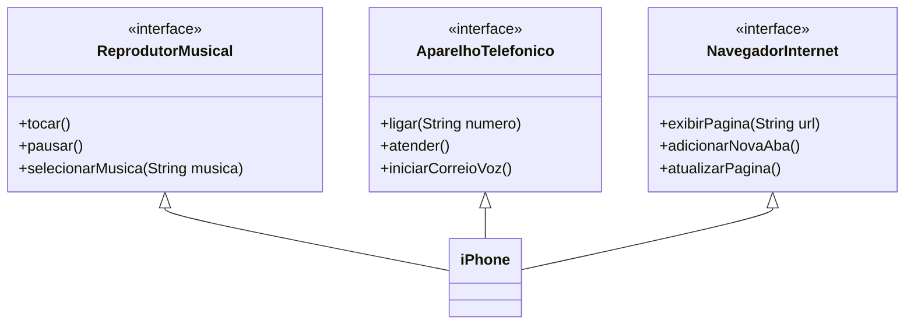

# POO - Desafio

# Modelagem e Diagramação de um Componente iPhone

Neste projeto, foi modelado e criado o diagrama para a representação UML do componente iPhone, abrangendo suas funcionalidades como Reprodutor Musical, Aparelho Telefônico e Navegador na Internet.

### Contexto
Com base no vídeo de lançamento do iPhone de 2007 (link abaixo), foi elaborada a diagramação das classes e interfaces UML neste README. Em seguida, implementadas as classes e interfaces no formato de arquivos `.java` neste projeto.

[Lançamento iPhone 2007](https://www.youtube.com/watch?v=9ou608QQRq8)
- Minutos relevantes: 00:15 até 00:55

### Funcionalidades a Modelar
1. **Reprodutor Musical**
   - Métodos: `tocar()`, `pausar()`, `selecionarMusica(String musica)`
2. **Aparelho Telefônico**
   - Métodos: `ligar(String numero)`, `atender()`, `iniciarCorreioVoz()`
3. **Navegador na Internet**
   - Métodos: `exibirPagina(String url)`, `adicionarNovaAba()`, `atualizarPagina()`

## Objetivo
1. Criar um diagrama UML que represente as funcionalidades descritas acima.
2. Implementar as classes e interfaces correspondentes em Java (Opcional).

## Diagrama de Classes do iPhone
Na pasta img/diagramas contém um arquivo de imagem SVG ilustrando o diagrama criado, mas  a seguir também é ilustrado:

